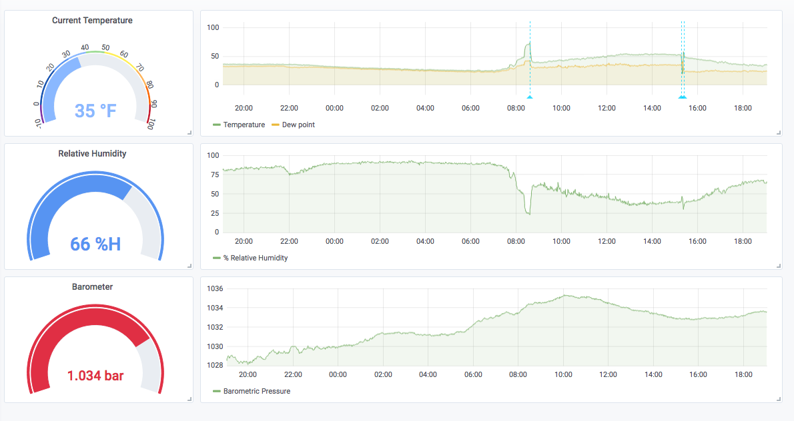

# weather_station
An ongoing arduino weather station work-in-progress.

The basic sketches here so far show a BME280 sensor driving an LCD screen and serving the same information via a simple web server using a WiFi shield. 

I dusted this back off and decided to give grafana/influxdb a try. The small perl script grabs the sensor data off of the arduino, parses it a bit, and then POSTs it to a local influxdb instance. Then you can use grafana to visualize the data. The script runs via a cron job once per minute, which may be a little aggressive. How fast does weather change, anyway?

